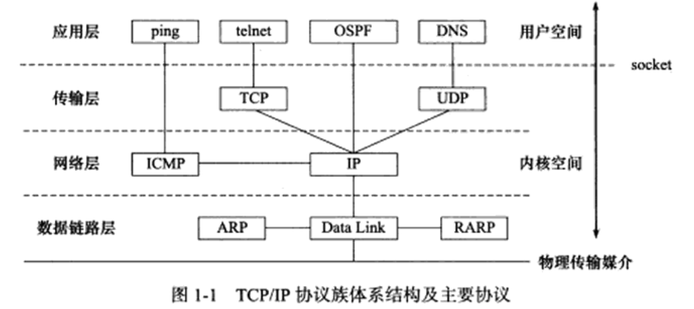
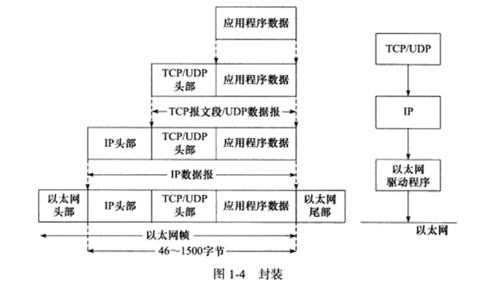
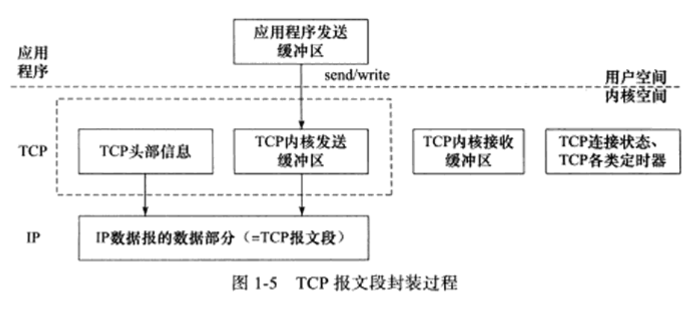
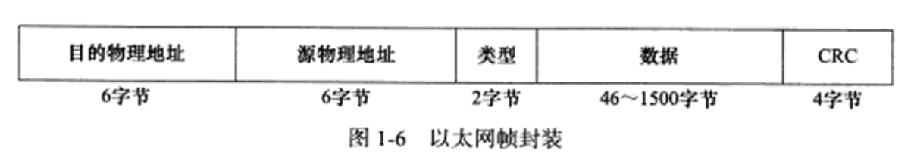
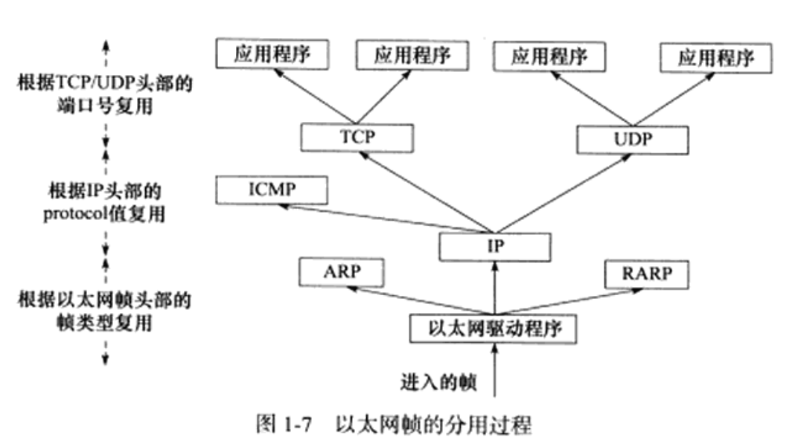
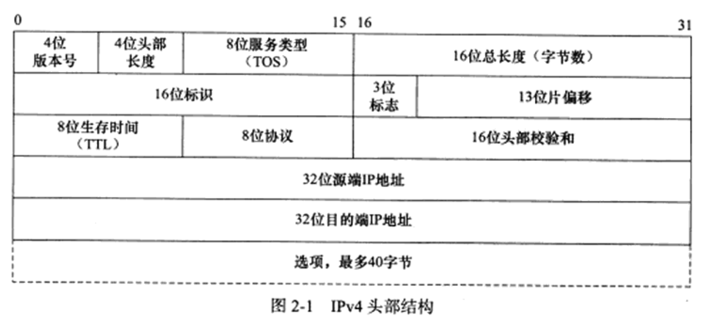
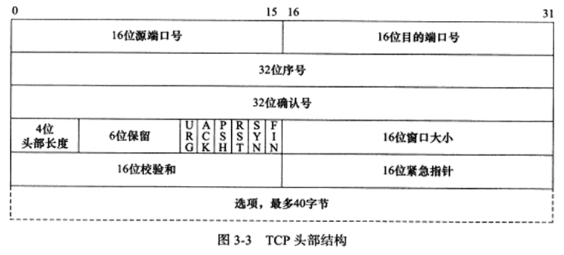
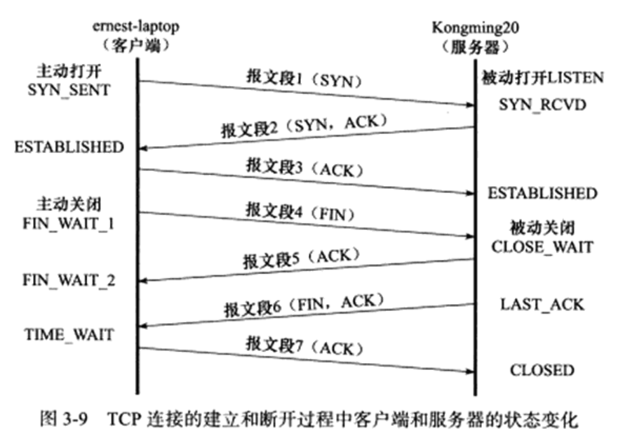
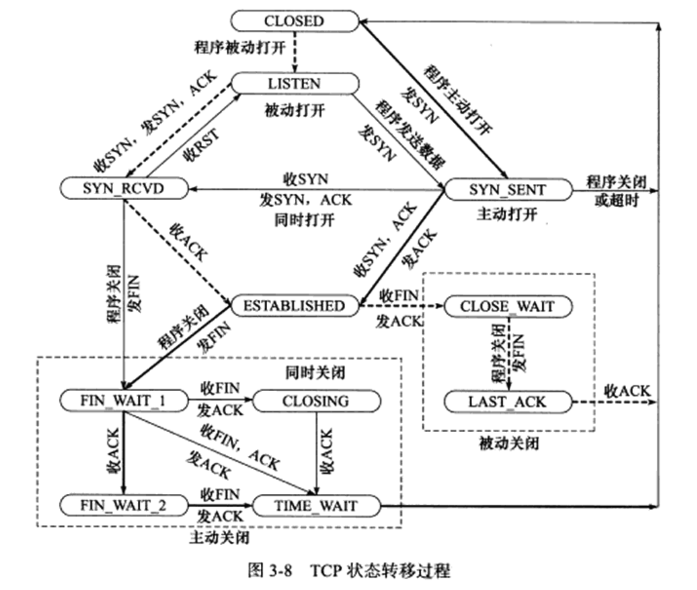
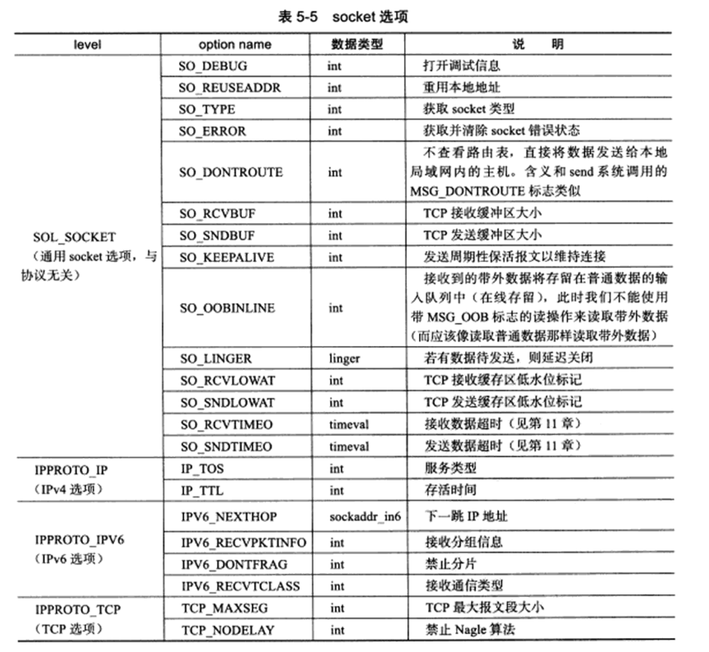

# 第一篇 TCP/IP 协议详解

## 第 1 章 TCP/IP 协议族

### OSI 七层模型

- 自顶向下依次为：应用层，表示层，会话层，传输层，网络层，数据链路层，物理层

### TCP/IP 四层模型

- 自顶向下依次为：应用层，传输层，网络层，数据链路层



#### 数据链路层

- 向上隐藏了不同物理设备的电气特性的差异，提供统一接口。
- ARP协议：实现LAN中IP地址向物理地址（通常是MAC地址）的转换
- RARP协议：实现LAN中物理地址（通常是MAC地址）向IP地址的转换

#### 网络层

- 实现数据包的选路和转发。WAN通常使用众多分级的路由器来连接分散的主机或LAN
- 向上隐藏网络拓扑，提供两台主机逻辑上的直接连接
- IP协议：根据数据包的目的IP地址来决定如何投递它。
- ICMP协议：因特网控制报文协议。用于检测网络连接。例如报告网络错误，目标不可达，重定向。也可以用于查询网络信息，例如 ping 使用 ICMP 报文查看目标是否可达。

#### 传输层

- 为两台主机的应用程序提供端到端的通信
- TCP协议：为应用层提供可靠的，面向连接的和基于流的服务。超时重传，数据确认。
- UDP协议：为应用层提供不可靠的，无连接的和基于数据报的服务。

#### 应用层

- 负责应用程序的逻辑，数据链路层，网络层和传输层负责处理网络通信细节，这部分必须稳定又高效，因此它们都在内核空间实现。而应用层协议绝大多数都在用户空间实现。
- ping程序：用于调试网络
- telnet协议：远程登录协议
- OSPF协议：动态路由更新协议
- DNS协议：提供机器域名到IP地址的转换

### 封装







### 分用



### ARP 协议

#### 工作原理：

- 主机向自己所在网络广播一个ARP请求，该请求包含目标机器的网络地址，此网络上的其他机器都将收到这个请求，但只有被请求的目标机器会回答一个ARP应答，其中包含自己的物理地址。

#### arp 命令

- arp -a 查看所有 arp 映射缓存
- arp -d <ipAddr> 删除 ipAddr 对应的 arp 表项
- arp -s <ipAddr> <macAddr> 添加 arp 表项

### DNS 协议

- DNS 是一套分布式域名服务系统，每个 DNS 服务器都存放着大量机器名和 IP 地址的映射，并且动态更新。
- DNS 查询分为递归式查询和迭代式查询。
- 查看 DNS 服务器配置：cat /etc/resolv.conf

### socket 和 TCP/IP 协议族的关系

#### socket 定义的一组api提供如下两个功能

- 将应用程序数据从用户缓冲区中复制到TCP/UDP内核发送缓冲区，或从内核缓冲区复制到用户缓冲区。例如 send、recv
- 用户程序可以通过socket api精细设定内核中各层协议的某些头部信息或其他数据结构。例如 setsockopt 函数

#### socket 是一套通用的网络，它不但可以访问内核中的TCP/IP协议栈，而且可以访问其他网络协议栈，例如UNIX本地域协议栈。

## 第 2 章 IP 协议详解

### IPv4 头部结构



- 4位版本号：IP协议版本，IPv4版本的版本号为4。
- 4位头部长度：IP头的长度，以4字节为基本偏移。
- 8位服务类型：可以用于设置需要最小延迟服务（ssh，telnet）、最大吞吐量（ftp）等。
- 16位总长度：IP数据报的总长度，以字节为基本偏移。包括头部和数据。
- 16位标识：唯一标识当前分片所属的IP数据报。
- 3位标志：第一位保留，第二位（DF，表示禁止分片），第三位（MF，表示后面还有分片）。
- 13位偏移：表示当前分片在数据报中的起始偏移，以8字节为基本偏移。
- 8位生存时间（TTL）：用于检测超时，例如初值设为64，每过一跳减1，减少到0则向源IP发送ICMP差错报文。
- 8位协议：标识上层数据使用等协议，例如TCP（6）、UDP（17）、ICMP（1）。
- 16位头部校验和：使用CRC校验头部是否损坏。

### IP 分片

- IP数据报总长度大于1500（MTU）时，需要进行分片。
- 如果需要进行分片，则最后一个IP分片的MF设置为0，其他分片的MF设置为1，且每个IP分片的13位偏移也不同。其余头部信息保持一致。

### IP 路由

- 1）从收到的IP分组的首部提取目的主机的IP地址D（即目的地址）
- 2）若查找到特定主机路由（目的地址位D），就按照这条路由的下一跳转发分组，否则从转发表中的下一条（即按前缀长度的顺序）开始检查，执行步骤3）。
- 3）将这一行的子网掩码与目的地址D进行按位与运算。若运算结果与本行前缀匹配，则查找结束，按照下一跳指出的进行处理（要么直接交付本网络上的目的主机，要么通过指定接口发送到下一跳路由器）。否则，若转发表还有下一行，则对下一行进行检查，重新执行步骤3）。否则，执行步骤4）。
- 4）若转发表中有一个默认路由，则把分组传送给默认路由，否则，报告转发分组出错。

### 路由表更新

- 静态更新：使用 route 命令手动增删改。
- 动态更新：通过协议更新：BGP、RIP、OSPF等。

### 重定向

- ICMP报文也能用于更新路由表（ICMP主机重定向报文）。
- ICMP重定向报文的数据部分含义很明确，它给出两个关键信息：引起重定向的IP数据报的源端IP地址和应该使用的路由器的IP地址。

### 私有IP

- A类：10.0.0.0 ~ 10.255.255.255
- B类：172.16.0.0 ~ 172.31.255.255
- C类：192.168.0.0 ~ 192.168.255.255

### NAT

- 路由器的NAT服务程序负责将 内网IP:端口 映射到 公网IP:端口。反之亦然。
- 主机发送数据时，先传到路由器，路由器通过NAT将数据报中的内网IP和端口号替换成对应的公网IP和端口号，然后向外递送，收到回复数据时，回复数据到达路由器后，路由器再把回复数据中的公网IP和端口号替换成内网IP和端口号，然后向内递送回主机。

### VPN

- TODO [2023.04.03]

## 第 3 章 TCP 协议详解

### TCP 服务的特点

- 面向连接
- 字节流
- 有限状态机
- 可靠传输
- 确认机制
- 超时重传
- 流量控制
- 拥塞控制

### TCP头部结构



- 32位序号：A发送给B的报文段字节序号为 [ x, y ]，则A发送的报文段的序号为 x。
- 32位确认号：A发送给B的报文段字节序号为 [ x, y ]，则B回复A的报文段的确认号设置为 y + 1。
- 4位头部长度：标识头部长度，以4字节为基本偏移。
- URG：紧急标志，标识紧急指针是否有效。
- ACK：标识确认号是否有效。
- PSH：标识接收端是否需要立即从TCP缓冲区中读走数据。
- RST：标识要求对方重新建立连接。称携带RST标志的TCP报文段为复位报文段。
- SYN：标识请求建立一个连接。称携带SYN标志的TCP报文段为同步报文段。
- FIN：标识通知对方本端要关闭连接了。称携带FIN标志的TCP报文段为结束报文段。
- 16位窗口大小：告诉对方本端的TCP接收缓冲区还能容纳多少个字节的数据。
- 16位校验和：用于检验整个TCP报文段（包含头部）在传输过程中是否损坏。
- 16位紧急指针：指向紧急数据所在的字节的下一个偏移地址。紧急数据只能是一个字节。

### TCP连接的建立和关闭



#### 三次握手

- 第一次握手：A向B发送带有SYN标志的报文段，并进入SYN_SENT状态。
- 第二次握手：B收到A的SYN报文后，向A回复带有SYN标志和ACK标志的报文段，并进入SYN_RCVD状态。
- 第三次握手：A收到B的回复报文后，向B发送带有ACK标志的报文段，并进入ESTABLISHED状态。B收到这个报文段后，B也会进入ESTABLISHED状态。

#### 四次挥手

- 第一次挥手：A向B发送带有FIN标志和ACK标志的报文段，并进入FIN_WAIT1状态。
- 第二次挥手：B收到A发送的挥手报文段，回复A一个带有ACK标志的报文段，并进入CLOSE_WAIT状态。A收到这个回复报文后，进入FIN_WAIT2状态。
- 第三次挥手：B向A发送带有FIN标志和ACK标志的报文段，并进入LAST_ACK状态。
- 第四次挥手：A收到B发送的挥手报文段，回复B一个带有ACK标志的报文段，进入TIME_WAIT状态。B收到这个回复报文后，关闭B到A的TCP连接。A进入TIME_WAIT后等待2MSL后，正常完全关闭。

#### 三次挥手的原理

- 第一次握手和第二次握手保证了A到B的TCP连接正常，且表达了A想要和B建立连接的意愿。
- 第二次握手和第三次握手保证了B到A的TCP连接正常，且表达了B同意与A建立连接的意愿。

#### 四次挥手的原理

- 第一次挥手和第二次挥手关闭A到B的TCP连接。此后B仍可向A发送数据，A也能正常接收，即B到A的TCP连接未关闭。
- 第三次挥手和第四次挥手关闭B到A的TCP连接。
- A进入TIME_WAIT后，需要等待2MSL，原因：
  - 可靠的终止TCP连接：若第四次挥手报文B没有正常接收到，则A进入TIME_WAIT一个MSL后，B会再次向A发送第三次挥手的报文，再过一个MSL后，A会收到这个重复的第三次挥手，那么A就知道了自己发送的第四次挥手报文段B未能正常接收，此时A重新发送第四次挥手报文段，并重置TIME_WAIT的计时。
  - 保证让迟来的TCP报文段有足够的时间被识别并丢弃。如果TIME_WAIT的等待时间少于2MSL，则有可能马上建立了一个新的TCP连接，这个连接使用了A的这个端口，此时若发生B重复发送第三次挥手的报文段，则这个挥手报文段会被新连接接收到，新连接中，A的这个端口不知道这个报文的意义是什么，导致了未定义行为。
- socket选项SO_REUSEADDR可以强制进程立即使用处于TIME_WAIT状态的连接占用的端口。

### TCP状态转移总图：（看看就好）



### 复位报文段

- 当客户端程序访问一个不存在的端口时，目标主机将给它发送一个复位报文段。
- 当客户端程序向服务器的某个端口发起连接，而该端口仍被处于TIME_WAIT状态的连接所占用时，客户端程序也将收到复位报文段。
- TCP提供一个异常终止连接的方法：给对方发送一个复位报文段，此时内核会丢弃所有排队等待发送的数据。应用程序可以使用socket选项SO_LINGER来发送复位报文段，以异常终止一个连接。
- A和B建立了一个TCP连接，然后A异常终止了连接，而B没有接收到结束报文段。此时B到A到连接还是存在的，此时A和B的TCP连接是半打开的，如果B向A发送数据，则A会向B回复一个复位报文段。

### TCP超时重传

- TCP每发送一个报文段，就对这个报文段设置一个计时器。计时器超时而还未收到这个报文段的确认时，就要重传这个报文段。
- 冗余ACK：例如，发送方A发送了序号为1、2、3、4、5的TCP报文段，其中2号报文段在链路中丢失，则3、4、5号报文段对于接收端B来说就成了失序报文段。TCP规定每当比期望需要大的失序报文段到达时，就发送一个冗余ACK，指明下一个期待字节的序号。3、4、5号报文到达B，但它们不是B所期望收到的下一个报文，于是B就发送3个对1号报文段的冗余ACK，表示自己期望接收到2号报文段。TCP规定当发送方收到对同一个报文段的3个冗余ACK时，就可以认为跟在这个被确认报文段之后的报文段已经丢失。则A认为2号报文段丢失，这时A可以立即对2号报文段执行重传，即使它的定时器还未超时，这种技术称为快速重传。

### TCP数据流

- 交互式数据流：使用交互数据流的程序或协议对实时性要求很高。例如telnet、ssh。
- 成块数据流：成块数据流的长度则通常为TCP报文段允许的最大数据长度。使用成块数据流的程序或协议对传输效率要求高，例如ftp。

### 拥塞控制

#### Nagle算法

- Nagle算法要求一个TCP连接的通信双方在任意时刻都最多只能发送一个未被确认的TCP报文段，在该TCP报文段的确认到达之前不能发送其他TCP报文段。
- 另一方面，发送方在等待确认的同时手机本端需要发送的微量数据，并在确认到来时以一个TCP报文段将它们全部发出，这样就极大地减少了网络上的微小TCP报文段的数量。
- 该算法的另一个优点在于其自适应性：确认到达得越快，数据也就发送得越快。

#### 接收窗口、拥塞窗口

- 接收方根据自己接收缓存的大小所许诺的最新窗口值，这称为接收窗口rwnd，设置为TCP头部的窗口字段值。
- 发送方根据其对当前网络拥塞程度的估计而确定的窗口值称为拥塞窗口cwnd。其大小与网络的带宽和时延密切相关。
- 发送窗口的上限值应取接收窗口rwnd和拥塞窗口cwnd中较小的一个。

#### 慢开始、拥塞避免

- 慢开始算法：TCP建立连接开始，令 cwnd=1，此后 cwnd = 2、4、8、......
- 拥塞避免算法：当 cwnd > ssthresh 时，停用慢开始算法，cwnd 转变为线性增加（每次加1）。
- 出现网络拥塞时（未按时收到确认时），设置 ssthresh 为出现拥塞时发送方的 cwnd 值的一半（但不能小于2）。然后把cwnd 重新设置为1，执行慢开始算法。

#### 快重传、快恢复

- 快重传：见TCP超时重传。
- 快恢复：当发送端收到三个冗余ACK时，设置 ssthresh 为此时发送方 cwnd 的值的一半，但发送方现在认为网络很可能没有发送严重拥塞，否则就不会收到三个冗余ACK，因此可以把cwnd设置为 ssthresh 改变后的数值，然后执行拥塞避免算法（每次加1），这称为快恢复。

## 第 4 章 TCP/IP 通信案例

### HTTP代理服务器工作原理

#### 正向代理

- 正向代理要求客户端自己设置代理服务器的地址。
- 客户端的每次请求都将直接发送到该代理服务器，并由该代理服务器来请求目标资源。
- 例如处于防火墙内部的局域网机器要访问Internet，或者要访问一些被屏蔽掉的国外网站，就需要使用正向代理服务器。

#### 反向代理

- 反向代理被设置在服务端，因而客户端无须进行任何设置。反向代理是指用代理服务器来接收Internet上的连接请求，然后将请求转发给内部网络上的服务器，并将从内部服务器上得到的结果返回给客户端。
- 这种情况下，代理服务器对外就表现为一个真实的服务器。各大网站通常分区设置了多个代理服务器，所以在不同的地方ping同一个域名可能得到不同的IP地址，因为这些IP地址实际上是代理服务器的IP地址。

#### 透明代理

- 透明代理只能设置在网关上。用户访问Internet的数据报必然会经过网关，如果在网关上设置代理，则该代理对用户来说显然是透明的。
- 透明代理可以看作正向代理的一种特殊情况。

### HTTP通信

#### HTTP请求

- HTTP请求头示例

  ```text
  GET http://www.baidu.com/index.html HTTP/1.0
  User-Agent: Wget/1.12 (linux-gnu)
  Host: www.baidu.com
  Connection: close
  ```

- HTTP请求方法

  | 请求方法 |                            含 义                             |
  | :------: | :----------------------------------------------------------: |
  |   GET    |         申请获取资源，而不对服务器产生任何其他影响。         |
  |   HEAD   | 和 GET 方法类似，不过仅要求服务器返回头部信息，而不需要传输任何实际内容。 |
  |   POST   |                客户端向服务器提交数据的方法。                |
  |   PUT    |                        上传某个资源。                        |
  |  DELETE  |                        删除某个资源。                        |
  |  TRACE   | 要求目标服务器返回原始的HTTP请求的内容。它可用于查看中间服务器（比如代理服务器）对HTTP请求的影响。 |
  | OPTIONS  | 查看服务器对某个特定URL都支持哪些请求方法。可以吧URL设置为 *，从而获取服务器支持的所有请求方法。 |
  | CONNECT  |  用于某些代理服务器，它们能把请求的连接转换为一个安全隧道。  |
  |  PATCH   |                    对某个资源做部分修改。                    |

#### HTTP应答

- HTTP应答示例

  ```text
  HTTP/1.0 200 OK
  Server: BWS/1.0
  Content-Length: 8024
  Content-Type: text/html;charset=gbk
  Set-Cookie: BAIDUID=A5B6C72D68CF639CE889FD79A03FBD8:FG=1; expires=Wed,04 -Jul-42 00:10:47 GMT; path=/; domain=.baidu.com
  Via: 1.0 localhost (squid/3.0 STABLE18)
  ```

- HTTP状态码

  | 状态类型       | 状态码和状态信息                  | 含 义                                                        |
  | -------------- | --------------------------------- | ------------------------------------------------------------ |
  | 1xx 信息       | 100 Continue                      | 服务器收到了客户端的请求行和头部信息，告诉客户端继续发送数据部分。 |
  | 2xx 成功       | 200 OK                            | 请求成功。                                                   |
  | 3xx 重定向     | 301 Moved Permanently             | 资源被转移了，请求将被重定向。                               |
  | 3xx 重定向     | 302 Found                         | 通知客户端资源能在其他地方找到，但需要使用GET方法获取。      |
  | 3xx 重定向     | 304 Not Modified                  | 表示申请的资源没有更新，和之前获得的相同。                   |
  | 3xx 重定向     | 307 Temporary Redirect            | 通知客户端资源能在其他地方找到，与302的区别在于客户端可以使用和原始请求相同的请求方法来访问目标资源。 |
  | 4xx 客户端错误 | 400 Bad Request                   | 通知客户端请求错误。                                         |
  | 4xx 客户端错误 | 401 Unauthorized                  | 请求需要认证信息。                                           |
  | 4xx 客户端错误 | 403 Forbidden                     | 访问被服务器禁止，通常是由于客户端没有权限访问该资源。       |
  | 4xx 客户端错误 | 404 Not Found                     | 找不到资源。                                                 |
  | 4xx 客户端错误 | 407 Proxy Authentication Required | 客户端需要先获得代理服务器的认证。                           |
  | 5xx 服务器错误 | 500 Internal Server Error         | 通用服务器错误。                                             |
  | 5xx 服务器错误 | 503 Service Unavailable           | 暂时无法访问服务器。                                         |

- Cookie：HTTP是一种无状态的协议，即每个HTTP请求之间没有任何上下文关系。对于交互式Web应用程序，要求承上启下，使用的解决方案是Cookie。Cookie是服务器发送给客户端的特殊信息（通过HTTP应答的头部字段"Set-Cookie"），客户端每次向服务器发送请求的时候都需要带上这些信息（通过HTTP请求的头部字段"Cookie"）。这样服务器就可以区分不同的客户了。基于浏览器的自动登录就是用Cookie实现的。

# 第二篇 深入解析高性能服务器编程

## 第 5 章 Linux 网络编程基础

### socket地址API

#### 字节序和大小端模式

```cpp
#include <netinet/in.h>
unsigned long int htonl(unsigned long int hostlong);
unsigned short int htons(unsigned short int hostshort);
unsigned long int ntohl(unsigned long int netlong);
unsigned short int ntohs(unsigned short int netshort);

// short 和 long 的主机序和网络序的互转换
```

#### 通用socket地址

```cpp
#include <bits/socket.h>
struct sockaddr {
  sa_family_t sa_family;
  char sa_data[14];	// 存放对应协议的地址，对于许多协议，14字节是不够的。
};
```

#### 专用socket地址

```cpp
#include <sys/un.h>

// UNIX域套接字
struct sockaddr_un {
  sa_family_t sin_family;	/* 地址族: AF_UNIX */
  char sun_path[108];			/* 文件路径名 */
};

// IPv4套接字
struct sockaddr_in {
  sa_family_t sin_family;	/* 地址族: AF_INET */
  uint16_t sin_port;			/* 端口号，要用网络字节序表示 */
  struct in_addr sin_addr;/* IPv4地址结构体 */
}
struct in_addr { uint32_t s_addr; };/* IPv4地址，要用网络字节序表示 */

// IPv6套接字
struct sockaddr_in6 {
  sa_family_t sin6_family;/* 地址族: AF_INET6 */
  uint16_t sin6_port;			/* 端口号，要用网络字节序表示 */
  uint32_t sin6_flowinfo;	/* 流信息，应设置为 0 */
  struct in6_addr sin6_addr;/* IPv6地址结构体 */
  uint32_t sin6_scope_id;	/* scope ID，尚处于实验阶段 */
}
struct in6_addr {
  unsigned char sa_addr[16];	/* IPv6地址，要用网络字节序 */
}
```

#### IP地址转换函数

```cpp
#include <arpa/inet.h>

// 将点分十进制字符串表示的IPv4地址转换为网络序的IPv4地址。失败时返回 INADDR_NONE
in_addr_t inet_addr(const char* strptr);

// 将点分十进制字符串表示的IPv4地址转换为网络序的IPv4地址。输出写到 inp 指针位置。
// 成功时返回1，失败则返回0
int inet_aton(const char* cp, struct in_addr* inp);

// 将网络序的IPv4地址转换为点分十进制的字符串
// 注意：该函数内部用一个静态变量存储转化结果，函数的返回值指向该静态内存，因此 inet_ntoa 是不可重入的。
char* inet_ntoa(struct in_addr in);

// 下面这对函数也能完成和上面三个函数同样的功能，并且支持IPv6
#include <arpa/inet.h>

/**
 * @brief 将IP地址字符串转换为网络序地址
 * @param af 协议类型：AF_INET 或 AF_INET6
 * @param src IPv4/v6地址字符串
 * @param dst 存储转换后网络序地址的内存指针
 * @return 1 转换成功，0 转换失败
 */
int inet_pton(int af, const char* src, void* dst);

/**
 * @brief 将网络序IP地址转换为字符串表示
 * @param af 协议类型：AF_INET 或 AF_INET6
 * @param src 指向网络序的IPv4/v6地址
 * @param dst 存储字符串的buffer
 * @param cnt buffer的长度
 * @return const char* 转换后的字符串
 */
const char* inet_ntop(int af, const void* src, char* dst, socklen_t cnt);
```

### 创建socket

```cpp
#include <sys/types.h>
#include <sys/socket.h>

/**
 * @brief 创建套接字
 * @param domain 底层协议类型：常见的如AF_INET(IPv4)、AF_INET6(IPv6)、AF_UNIX(unix)
 * @param type 传输层协议类型：SOCK_STREAM(流服务)、SOCK_DGRAM(数据报服务)
 * @param protocol 传输层协议，限制了 domain 和 type 后，仍可能不止一种协议满足条件，必要时需要具体指出
 * @return 套接字描述符
 * @notice linux 2.6.17 起，type参数可以或上 SOCK_NOBLOCK 和 SOCK_CLOEXEC
 */
int socket(int domain, int type, int protocol);
```

### 命名socket

```cpp
#include <sys/types.h>
#include <sys/socket.h>

/**
 * @brief 为套接字描述符绑定套接字地址
 * @param sockfd 套接字描述符
 * @param my_addr 套接字地址
 * @param addrlen 套接字地址的长度
 * @return 0 bind成功，-1 bind失败
 * @notice 常见的绑定失败时的errno有：
 *	EACCES: 被绑定的地址是受保护的地址，仅超级用户能够访问。例如普通用户将socket绑定到知名服务端口(0~1023)
 *	EADDRINUSE: 被绑定的地址正在使用中。例如将socket绑定到一个处于TIME_WAIT状态的socket地址
 */
int bind(int sockfd, const struct sockaddr* my_addr, socklen_t addrlen);
```

### 监听socket

```cpp
#include <sys/socket.h>

/**
 * @brief 创建一个监听队列以存放待处理的客户连接
 * @param sockfd 监听套接字
 * @param backlog 提示内核监听队列的最大长度，监听队列的长度如果超过backlog，服务器将不再受理新的客户
 *  连接，客户端也将收到 ECONNREFUSED 错误信息.
 * @return 0 succeed, -1 failed.
 */
int listen(int sockfd, int backlog);
```

### 接受连接

```cpp
#include <sys/types.h>
#include <sys/socket.h>

/**
 * @brief 从listen监听队列中接受一个连接
 * @param sockfd 监听套接字
 * @param addr 用于获取被接受连接的远端socket地址
 * @param addrlen 指出 addr 指向的socket地址结构的长度
 * @return 成功时返回一个新的连接套接字，失败时返回-1
 * @note 如果accept的客户端在accept调用前断开，则accept无法察觉这个变化，仍然会成功accept
 */
int accept(int sockfd, struct sockaddr* addr, socklen_t* addrlen);
```

### 发起连接

```cpp
#include <sys/types.h>
#include <sys/socket.h>

/**
 * @brief 主动与服务器建立连接
 * @param sockfd 客户端套接字，不需要绑定地址（系统会自动分配）
 * @param serv_addr 服务器监听地址
 * @param addrlen 指出 serv_addr 指向的地址的长度
 * @return 0 succeed, -1 failed.
 * @notice 常见的连接失败时的errno有：
 *  ECONNREFUSED 目标端口不存在，连接被拒绝
 *  ETIMEDOUT 连接超时
 */
int connect(int sockfd, const struct sockaddr *serv_addr, socklen_t addrlen);
```

### 关闭连接

```cpp
#include <unistd.h>

// 注意，此函数仅将fd的引用计数减1，只有fd引用计数为0时，才真正关闭连接
int close(int fd);

#include <sys/socket.h>

/**
 * @brief 不论引用计数多少，直接关闭连接
 * @param sockfd 待关闭套接字
 * @param howto 控制关闭行为
 *  SHUT_RD shutdown后不能再从套接字读取
 *  SHUT_WR shutdown后不能再向套接字写入
 *  SHUT_RDWR 同时关闭读写
 * @return 0 succeed, -1 failed
 */
int shutdown(int sockfd, int howto);
```

### 数据读写

#### TCP数据读写

```cpp
#include <sys/types.h>
#include <sys/socket.h>

/**
 * @brief 从套接字内核接收缓冲区读取内容
 * @param sockfd 套接字
 * @param buf 用户接收缓冲
 * @param len 指示buf的大小
 * @param flags 控制接收行为
 * @return 成功时返回实际读取到的数据的长度，可能为0，这表示对方已经关闭连接了。出错返回-1
 */
ssize_t recv(int sockfd, void* buf, size_t len, int flags);

/**
 * @brief 向套接字内核发送缓冲区写入数据
 * @param sockfd 套接字
 * @param buf 用户发送缓冲
 * @param len 指示buf的大小
 * @param flags 控制发送行为
 * @return 成功时返回实际写入的数据的长度，失败时返回-1.
 */
ssize_t send(int sockfd, const void* buf, size_t len, int flags);
```

| 选项名        | 含 义                                                        | send | recv |
| ------------- | ------------------------------------------------------------ | ---- | ---- |
| MSG_CONFIRM   | 指示数据链路层协议持续监听对方的应答，直到得到回复。它仅能用于SOCK_DGRAM和SOCK_RAW类型的socket | Y    | N    |
| MSG_DONTROUTE | 不查看路由表，直接将数据发送给本地局域网络内的主机。这表示发送者确切地知道目标主机就在本地网络上 | Y    | N    |
| MSG_DONTWAIT  | 对socket的这次操作将是非阻塞的                               | Y    | Y    |
| MSG_MORE      | 告诉内核应用程序还有更多的数据要发送，内核将超时等待新数据写入TCP发送缓冲区后一并发送。这样可防止TCP发送过多小的报文段，从而提高传输效率 | Y    | N    |
| MSG_WAITALL   | 读操作仅在读取到指定数量的字节后才返回                       | N    | Y    |
| MSG_PEEK      | 窥视读缓存中的数据，此次读操作不会导致这些数据被清除         | N    | Y    |
| MSG_OOB       | 发送或接收紧急数据                                           | Y    | Y    |
| MSG_NOSIGNAL  | 往读端关闭的管道或者socket连接中写数据时不引发SIGPIPE信号    | Y    | N    |

#### UDP数据读写

```cpp
#include <sys/types.h>
#include <sys/socket.h>

ssize_t recvfrom(int sockfd, void* buf, size_t len, int flags, struct sockaddr* src_addr, socklen_t* addrlen);

ssize_t sendto(int sockfd, const void* buf, size_t len, int flags, const struct sockaddr* dest_addr, socklen_t addrlen);
```

#### 通用数据读写函数

```cpp
#include <sys/types.h>
#include <sys/socket.h>

ssize_t recvmsg(int sockfd, struct msghdr* msg, int flags);
ssize_t sendmsg(int sockfd, struct msghdr* msg, int flags);

struct msghdr {
  void* msg_name;						/* socket地址 */
  socklen_t msg_namelen;		/* socket地址的长度 */
  struct iovec* msg_iov;		/* 分散的内存块，用于分散读和集中写 */
  int msg_iovlen;						/* 分散内存块的数量 */
  void* msg_control;				/* 指向辅助数据的起始位置 */
  socklen_t msg_controllen;	/* 辅助数据的大小 */
  int msg_flags;						/* 复制函数中的flags参数，并在调用过程中更新 */
};

struct iovec {
  void* iov_base;	/* 内存起始地址 */
  size_t iov_len;	/* 这块内存的长度 */
};
```

### 带外标记

```cpp
#include <sys/socket.h>

// 判断sockfd是否处于带外标记，如果是，返回1，此时我们可以利用带MSG_OOB标志的recv调用来接收带外数据，否则返回0.
int sockatmark(int sockfd);
```

### 地址信息函数

```cpp
#include <sys/socket.h>

// 获取sockfd对应的本端socket地址
int getsockname(int sockfd, struct sockaddr* address, socklen_t* address_len);

// 获取sockfd对应的远端socket地址
int getpeername(int sockfd, struct sockaddr* address, socklen_t* address_len);
```

### socket选项

```cpp
#include <sys/socket.h>

int getsockopt(int sockfd, int level, int option_name, void* option_value, socklen_t* restrict option_len);

int setsockopt(int sockfd, int level, int option_name, const void* option_value, socklen_t option_len);
```



#### SO_REUSEADDR选项

- TIME_WAIT状态
- 设置改选项后，即使sock处于TIME_WAIT，与之绑定的socket地址也可以立即被重用

#### SO_RCVBUF和SO_SNDBUF选项

- 用于设置TCP接收缓冲区和发送缓冲区的大小。
- 当我们用setsockopt来设置缓冲区大小时，系统都会将其值加倍，并且确保不得小于某一个最小值。

#### SO_RCVLOWAT和SO_SNDLOWAT选项

- SO_RCVLOWAT和SO_SNDLOWAT选项分别表示TCP接收缓冲区和发送缓冲区的低水位标记。
- 它们一般用于IO复用系统调用，用来判断socket是否可读或可写。
- 当TCP接收缓冲区中可读数据的总数大于其低水位标记时，IO复用系统调用将通知应用程序可以从对应的socket上读取数据。
- 当TCP发送缓冲区的空闲空间大于其低水位标记时，IO复用系统调用将通知应用程序可以往对应的socket上写入数据。
- 默认情况下，读写低水位标志都是1字节。

#### SO_LINGER选项

- 默认情况下，使用 close 系统调用关闭套接字描述符时，close将立即返回，TCP模块负责把该socket对应的TCP发送缓冲区中残留的数据发送给对方。

- 设置或读取 SO_LINGER 选项的值的时候，option_value 需要指向一个专用结构体

  ```cpp
  #include <sys/socket.h>
  
  struct linger {
    int l_onoff;	/* 开启或关闭linger选项 */
    int l_linger; /* 滞留时间 */
  };
  ```

  - l_onoff 等于0。此时 SO_LINGER 选项不起作用，close 系统调用采用默认行为关闭socket。
  - l_onoff 不为0，l_linger 等于0。此时 close 吸引调用立即返回，TCP模块将丢弃被关闭的socket对应的TCP发送缓冲区中残留的数据，同时给对方发送一个复位报文段。因此，这种情况给服务器提供了异常终止一个连接的方法。
  - l_onoff 不为0，l_linger 大于0。此时close的行为取决于两个条件：一是被关闭的socket对应的TCP发送缓冲区中是否还残留有数据；二是该socket时阻塞的还是非阻塞的。对于阻塞的socket，close将等待一段长为 l_linger 的时间，直到TCP模块发送完所有残留数据并得到对方的确认。如果超时，则 close 调用返回-1，设置errno 为 EWOULDBLOCK。如果 socket 是非阻塞的，close将立即返回，此时我们需要根据其返回值和errno来判断残留数据是否已经发送完毕。

### 网络信息API

#### gethostbyname和gethostbyaddr

```cpp
#include <netdb.h>
struct hostent* gethostbyname(const char* name);
struct hostent* gethostbyaddr(const void* addr, size_t len, int type);

struct hostent {
  char* h_name;			/* 主机名 */
  char**h_aliases;	/* 主机别名列表，可能有多个 */
  int   h_addrtype;	/* 地址类型（地址族） */
  int   h_length;		/* 地址长度 */
  char**h_addr_list;/* 按网络字节序列出的主机IP地址列表 */
};
```

#### getservbyname和getservbyport

```cpp
#include <netdb.h>

struct servent* getservbyname(const char* name, const char* proto);
struct servent* getservbyport(int port, const char* proto);

struct servent {
  char* s_name;		/* 服务名称 */
  char**s_aliases;/* 服务的别名列表，可能有多个 */
  int   s_port;		/* 端口号 */
  char* s_proto;	/* 服务类型，通常是tcp或者udp */
};
```

#### getaddrinfo

```cpp
#include <netdb.h>

int getaddrinfo(const char* hostname, const char* service, const struct addrinfo* hints, struct addrinfo** result);

void freeaddrinfo(struct addrinfo* res);

struct addrinfo {
  int ai_flags;
  int ai_family;
  int ai_socktype;
  int ai_protocol;
  socklen_t ai_addrlen;
  char* ai_canonname;
  struct sockaddr* ai_addr;
  struct addrinfo* ai_next;
};
```

#### getnameinfo

```cpp
#include <netdb.h>

int getnameinfo(const struct sockaddr* sockaddr, socklen_t addrlen, char* host, socklen_t hostlen, char* serv, socklen_t servlen, int flags);

const char* gai_strerror(int error);
```

## 第 6 章 高级 I/O 函数

### pipe 函数

### dup函数和dup2函数

### readv函数和writev函数

### sendfile函数

### mmap函数和munmap函数

### splice函数

### tee函数

### fcntl函数

## 第 7 章 Linux 服务器编程规范

### 日志

### 用户信息

### 进程间关系

### 系统资源限制

### 改变工作目录和根目录

### 服务器程序后台化

## 第 8 章 高性能服务器程序框架

### 服务器模型

### 服务器编程框架

### IO模型

### 两种高效的事件处理模式

#### Reactor模式

#### Proactor模式

### 两种高效的并发模式

### 有限状态机

### 提高服务器性能的其他建议

## 第 9 章 I/O 复用

### select系统调用

#### poll系统调用

### epoll系列系统调用

### 三种IO复用函数的比较

### IO复用的高级应用一：非阻塞connect

### IO复用的高级应用二：聊天室程序

### IO复用的高级应用三：同时处理TCP和UDP服务

### 超级服务xinetd

## 第 10 章 信号

### Linux信号概述

### 信号函数

### 信号集

### 统一事件源

### 网络编程相关信号

## 第 11 章 定时器

### socket选项SO_RCVTIMEO和SO_SNDTIMEO

### SIGALRM信号

### IO复用系统调用的超时参数

### 高性能定时器

#### 时间轮

#### 时间堆

## 第 12 章 高性能 I/O 框架库 libevent

### IO框架库概述

### Libevent源码分析

## 第 13 章 多进程编程

### fork系统调用

### exec系列系统调用

### 处理僵尸进程

### 管道

### 信号量

### 共享内存

### 消息队列

### IPC命令

### 在进程间传递文件描述符

## 第 14 章 多线程编程

### Linux线程概述

### 创建线程和结束线程

### 线程属性

### POSIX信号量

### 互斥锁

### 条件变量

### 线程同步机制包装类

### 多线程环境

## 第 15 章 进程池和线程池

### 进程池和线程池概述

### 处理多客户

### 半同步/半异步进程池实现

### 用进程池实现的简单CGI服务器

### 半同步/半反应堆线程池实现

### 用线程池实现的简单Web服务器

# 第三篇 高性能服务器优化与监测

## 第 16 章 服务器调制、调试和测试

## 第 17 章 系统监测工具


